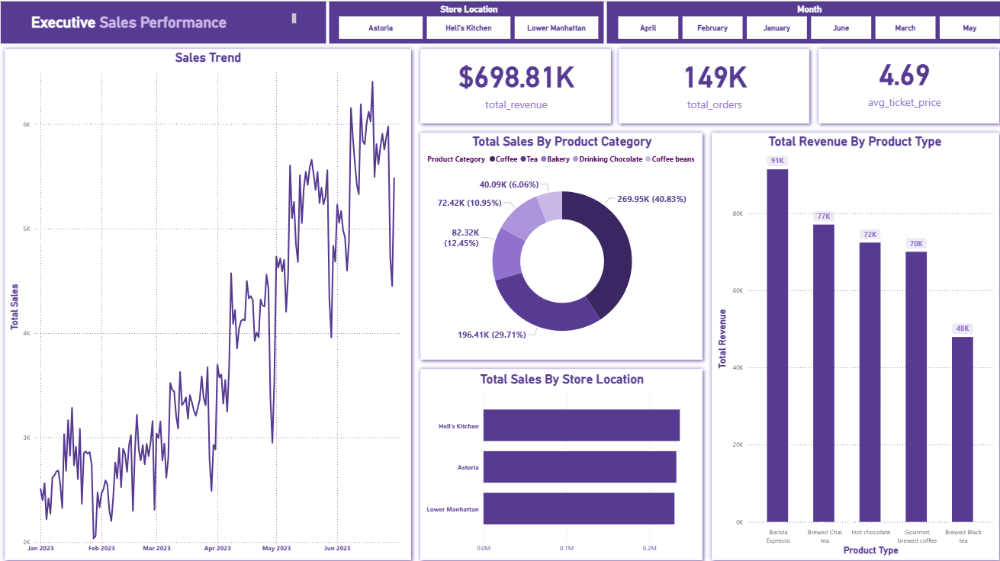
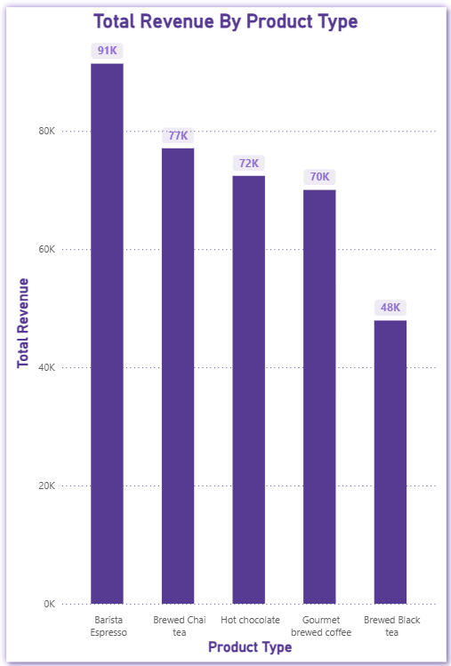
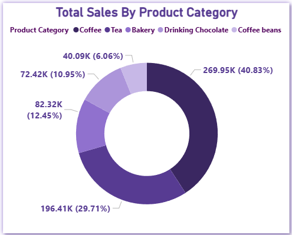

# Coffee Shop Sales Analysis & Operations Optimization

## 📌 Project Overview
This project focuses on analyzing transactional data from a multi-location coffee shop business (Lower Manhattan, Hell's Kitchen, and Astoria) to uncover actionable insights for operational efficiency, marketing strategies, and product management. 

By cleaning raw transactional data with **Python (Pandas)** and performing deep-dive relational analysis with **PostgreSQL**, this project provides data-driven answers to business-critical questions regarding peak hours staffing, menu optimization (80/20 rule), and customer purchasing behavior.

---

## 📊 Key Insights & Business Impact
* **Total Revenue Analyzed:** $698,812.33 across 149,116 transaction records.
* **Top Locations:** Sales are distributed across three primary strategic locations: Lower Manhattan, Hell's Kitchen, and Astoria.
* **Peak Hour Optimization:** Identified precise "rush hours" for each store to optimize barista staffing schedules and reduce customer wait times.
* **Menu Rationalization:** Applied the 80/20 rule to categorize high-performing products (e.g., Coffee and Tea) vs. underperforming items to maximize shelf-space profitability.

---

## 🛠️ Tech Stack & Tools
* **Data Cleaning & Feature Engineering:** Python (Pandas, Jupyter Notebook)
* **Database & Analytical Queries:** PostgreSQL (Common Table Expressions (CTEs), Window Functions, Aggregations)
* **Visualization / Dashboard:** [Specify your tool here, e.g., Power BI / Tableau / Excel / Matplotlib]

---

## 📁 Project Structure
```text
├── data/
│   ├── coffee_shop_sales_cleaned.csv  # Cleaned dataset used for analysis
│   ├── coffee_shop_sales_.csv # Raw dataset
├── script/
│   ├── cleaning_data.ipynb             # Python data cleaning script
│   ├── sql_analysis.sql                # Production SQL queries
└── README.md                           # Project documentation
```

### 🔄 Step 1: Data Cleaning & Preprocessing (Python)
The raw dataset was processed using Python to ensure data integrity, handle inconsistencies, and engineer features required for temporal analysis.
Checked for missing values and duplicates.
Formatted date and time columns.
Extracted month_name and day_of_week to enable time-series slicing.
Created calculated fields: total_sales = transaction_qty * unit_price.

#### Data Cleaning Code Snippet:

```python
import pandas as pd

# Load dataset
df = pd.read_excel("coffee_shop_sales.xlsx")

# Drop duplicate rows
df = df.drop_duplicates()

# Feature Engineering: Extract time features & Calculate Revenue
df['transaction_date'] = pd.to_datetime(df['transaction_date'])
df['month_name'] = df['transaction_date'].dt.strftime('%B')
df['day_of_week'] = df['transaction_date'].dt.strftime('%A')
df['total_sales'] = df['transaction_qty'] * df['unit_price']

# Export cleaned data
df.to_csv("coffee_shop_sales_cleaned.csv", index=False)
```

### 🗄️ Step 2: Data Exploration & SQL Deep Dive (PostgreSQL)
After loading the cleaned data into a PostgreSQL database, several advanced business queries were executed.
1. Staffing Optimization (Peak Hours Analysis)
Using SQL Window Functions to determine the top 3 busiest hours for each store location to align staff scheduling with real foot traffic.

```Sql
WITH rush_hour AS (
    SELECT 
        store_location,
        EXTRACT(HOUR FROM transaction_time) AS hour_only,
        COUNT(transaction_id) AS total_order,
        ROW_NUMBER() OVER (
            PARTITION BY store_location
            ORDER BY COUNT(transaction_id) DESC
        ) AS rn
    FROM coffee_sales
    GROUP BY store_location, hour_only
)
SELECT store_location, hour_only, total_order
FROM rush_hour
WHERE rn <= 3
ORDER BY store_location, total_order DESC;
```

2. Menu Rationalization (The 80/20 Revenue Rule)
Analyzing product categories to see which categories generate the highest percentage of total business revenue.

```Sql
SELECT product_category,
       ROUND(SUM(total_sales::numeric), 2) as totalsales,
       ROUND(SUM(total_sales::numeric) * 100.0 / SUM(SUM(total_sales::numeric)) OVER (), 2) AS revenue_percentage
FROM coffee_sales
GROUP BY product_category
ORDER BY totalsales DESC;
```

3. Weekday vs. Weekend Split
Identifying revenue trends and average customer spend variations between weekdays and weekends to adjust inventory levels.

```Sql
SELECT
    store_location,
    CASE WHEN EXTRACT(ISODOW FROM transaction_date) IN (6, 7) THEN 'Weekend' ELSE 'Weekday' END AS day_type,
    ROUND(SUM(total_sales::numeric), 2) AS total_revenue,
    ROUND(AVG(total_sales::numeric), 2) AS avg_spend_per_transaction
FROM coffee_sales
GROUP BY store_location, day_type
ORDER BY store_location, day_type;
```

## 📊 Dashboard & Visualizations
### 1. Sales Performance & Operational Dashboard
Below is the comprehensive dashboard illustrating monthly sales trends, category performance, and peak order times across store locations.



### 2. Key Findings Chart: Product Category Revenue Share

By analyzing the product distribution, we can observe the 80/20 rule in effect, where a couple of core categories drive the vast majority of the business's total revenue.





* **Core Revenue Drivers:** **Coffee** is the undisputed top-performing category, contributing **$269.95K (40.83%)** of total sales, followed closely by **Tea** at **$196.41K (29.71%)**. Together, they account for over 70% of the coffee shop's total income.
* **Top Product Types:** Looking into the product breakdown, **Barista Espresso** ($91K) and **Brewed Chai Tea** ($77K) are the individual products driving the highest transaction volumes and financial impact.
* **Operational Strategy:** Since Coffee and Tea represent the baseline of steady income, operational focus should remain on maintaining high-quality beans/tea supply chains, while utilizing cross-selling or bundling strategies to lift smaller segments like Bakery (12.45%) and Drinking Chocolate (10.95%).

## 💡 Strategic Recommendations
* **Dynamic Staff Scheduling:** Align labor shifts with the identified peak hours in Manhattan, Hell's Kitchen, and Astoria to capture all demand while minimizing idle hours.

* **Promotional Bundling:** Leverage high-volume products (Coffee & Tea) to create bundles with lower-volume, high-margin items (e.g., Packaged Chocolate/Branded merchandise).

* **Inventory Management:** Restock fresh bakery items and high-demand milk varieties based on the Weekday vs. Weekend sales volume distribution.